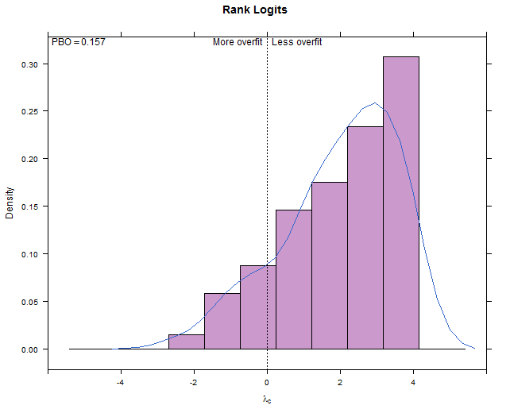
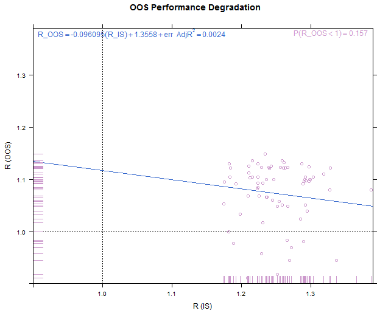
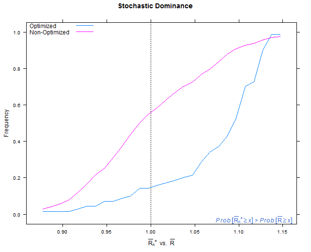
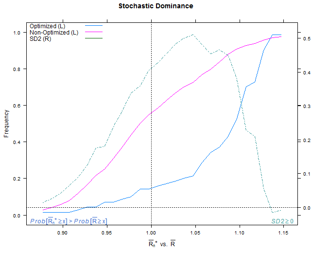

Probability of Backtest Overfitting
===================================

Implements in R some of the ideas found in the Bailey et al. paper identified below.  In particular we use combinatorially symmetric cross validation (CSCV) to implement strategy performance tests evaluated by the Omega ratio. We compute the probability of backtest overfit, performance degradation, probability of loss, and stochastic dominance.  We plot visual representations of these using the `lattice` package.     

The reference authors used the Sharpe ratio as the performance measure.  Other measures are suitable according to the assumptions laid out in the paper.

Example plots attached below.

Packages
--------
* `utils` for the combinations
* `PerformanceAnalytics` for the Omega ratio
* `lattice` for plots
* `latticeExtra` over plot overlays only for the SD2 measure

Reference
---------
Bailey, David H. and Borwein, Jonathan M. and Lopez de Prado, Marcos and Zhu, Qiji Jim, The Probability of Back-Test Overfitting (September 1, 2013). Available at SSRN: http://ssrn.com/abstract=2326253 or http://dx.doi.org/10.2139/ssrn.2326253

