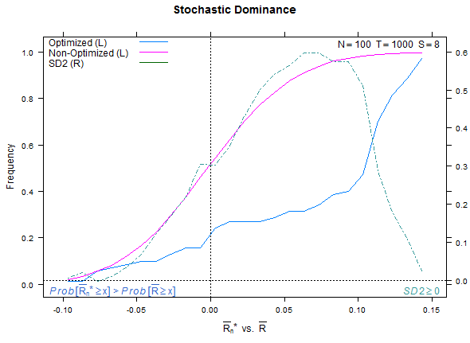
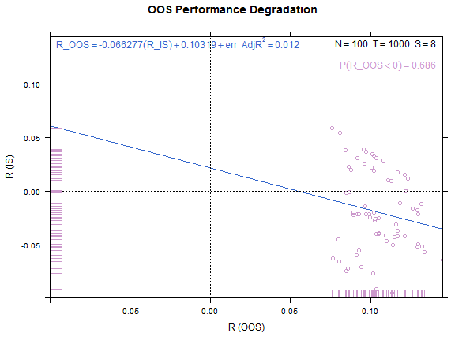
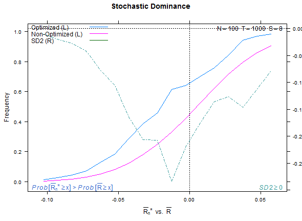
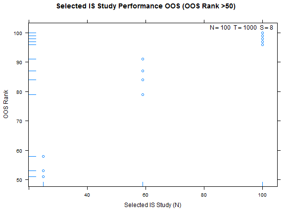
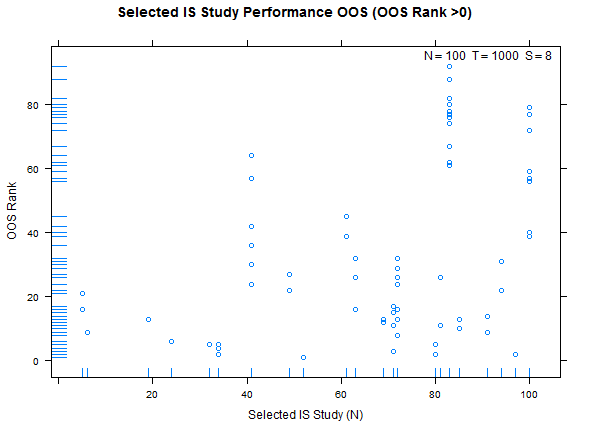
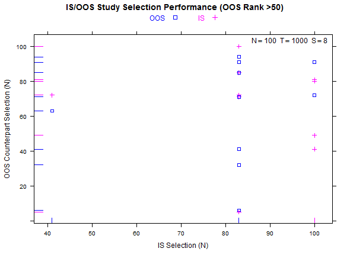
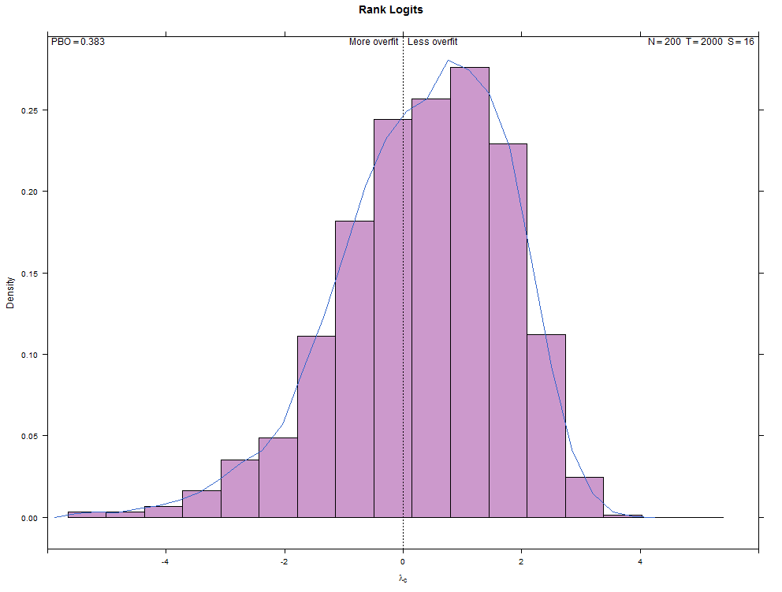
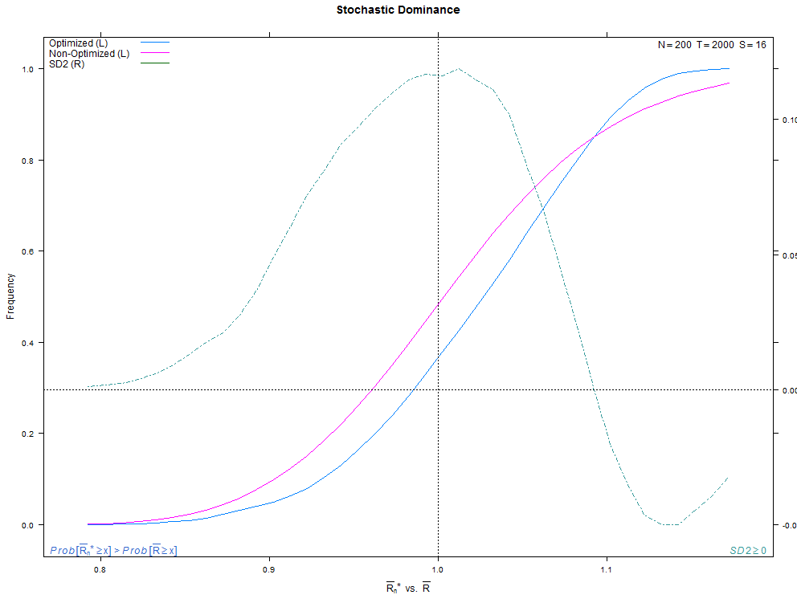
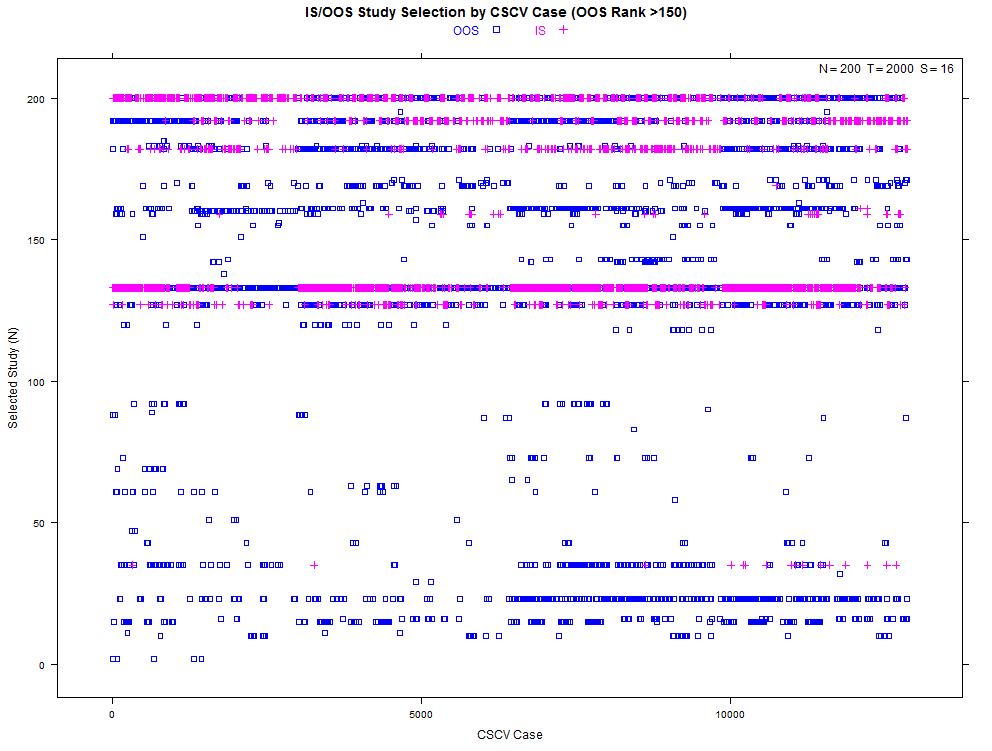

Probability of Backtest Overfitting
===================================

**News: This [R package PBO](https://CRAN.R-project.org/package=pbo) is available on CRAN.**

Implements in R some of the ideas found in the Bailey et al. paper identified below.  In particular we use combinatorially symmetric cross validation (CSCV) to implement strategy performance tests evaluated by the Omega ratio. We compute the probability of backtest overfit, performance degradation, probability of loss, and stochastic dominance.  We plot visual representations of these using the `lattice` package.     

The reference authors used the Sharpe ratio as the performance measure.  Other measures are suitable according to the assumptions laid out in the paper.

Example plots attached below.  The first four illustrate a test with low overfitting (T-distribution, N=100, T=1600, S=8). The second four illustrate a test from the reference paper with high overfitting (normal distribution, N=100, T=1000, S=8).  The third batch illustrate some study selection performance plots for both cases.  

Example test case, low overfitting:





Reference test case 1, high overfitting:





Example study selection performance for the low and high cases:









More examples with a larger number of combinations on the same high- and low-overfitting test cases.  There are 12,780 CSCV combinations with the these tests (normal distribution, N=200, T=2000, S=16, Omega ratio performance).  









Installation
------------
```{r}
require(devtools)
install_github('pbo',username='mrbcuda')
```

Example
-------
```{r}
require(pbo)
require(lattice) # for plots
require(PerformanceAnalytics) # for Omega ratio

N <- 200                 # studies, alternative configurations
T <- 3200                # sample returns
S <- 8                   # partition count

# load the matrix with samples for N alternatives
M <- data.frame(matrix(NA,T,N,byrow=TRUE,dimnames=list(1:T,1:N)),check.names=FALSE)
for ( i in 1:N ) M[,i] <- rt(T,10) / 100

# compute and plot
my_pbo <- pbo(M,S,F=Omega,threshold=1)
summary(my_pbo)
histogram(my_pbo)
dotplot(my_pbo,pch=15,col=2,cex=1.5)
xyplot(my_pbo,plotType="cscv",cex=0.8,show_rug=FALSE,osr_threshold=100)
xyplot(my_pbo,plotType="degradation")
xyplot(my_pbo,plotType="dominance",lwd=2)
xyplot(my_pbo,plotType="pairs",cex=1.1,osr_threshold=75)
xyplot(my_pbo,plotType="ranks",pch=16,cex=1.2)
xyplot(my_pbo,plotType="selection",sel_threshold=100,cex=1.2)
```

Example with Parallel Processing
--------------------------------
```{r}
require(pbo)
require(lattice)
require(PerformanceAnalytics)
require(doParallel)      # for parallel processing

N = 200
T = 2000
S = 16

# create some phony trial data
sr_base = 0
mu_base = sr_base/(260.0)
sigma_base = 1.00/(260.0)**0.5

M <- data.frame(matrix(NA,T,N,byrow=TRUE,dimnames=list(1:T,1:N)),
                check.names=FALSE)

M[,1:N] <- rnorm(T,mean=0,sd=1)
x <- sapply(1:N,function(i) {
            M[,i] = M[,i] * sigma_base / sd(M[,i])
            M[,i] = M[,i] + mu_base - mean(M[,i])
            })

# tweak one trial to exhibit low overfit
sr_case = 1
mu_case = sr_case/(260.0)
sigma_case = sigma_base

i = N
M[,i] <- rnorm(T,mean=0,sd=1)
M[,i] = M[,i] * sigma_case / sd(M[,i]) # re-scale
M[,i] = M[,i] + mu_case - mean(M[,i]) # re-center

cluster <- makeCluster(detectCores())
registerDoParallel(cluster)
pp_pbo <- pbo(M,S,F=Omega,threshold=1,allow_parallel=TRUE)
stopCluster(cluster)
histogram(pp_pbo)
```

Packages
--------
* `utils` for the combinations
* `lattice` for plots
* `latticeExtra` over plot overlays only for the SD2 measure
* `grid` for plot labeling
* `foreach` for parallel computation of the backtest folds

Reference
---------
Bailey, David H. and Borwein, Jonathan M. and Lopez de Prado, Marcos and Zhu, Qiji Jim, The Probability of Back-Test Overfitting (September 1, 2013). Available at SSRN: https://papers.ssrn.com/sol3/papers.cfm?abstract_id=2326253.


